# supi-flow

PI extension for spec-driven workflow with TNDM ticket coordination (optional for trivial changes).

## Flow

```mermaid
flowchart TD
    START(["Start a change"]) --> BRAIN
    BRAIN["/skill:supi-flow-brainstorm
         HARD-GATE: no code yet
         Explore, design, approve
         Classify trivial vs non-trivial"]
    BRAIN --> APPROVED{Design approved?}
    APPROVED -->|"No"| BRAIN
    APPROVED -->|"Yes"| TRIVIAL{Trivial change?}

    TRIVIAL -->|"Yes (skip ticket)"| LIGHT["Implement directly
         No ticket needed"]
    TRIVIAL -->|"No"| PLAN

    PLAN["/skill:supi-flow-plan [ID]
         Bite-sized tasks
         Exact file paths
         No placeholders
         TDD: red-green-refactor
         Stores plan via supi_flow_plan"]
    PLAN --> APPROVE2{"Plan approved?"}
    APPROVE2 -->|"No"| PLAN
    APPROVE2 -->|"Yes"| APPLY

    APPLY["/skill:supi-flow-apply [ID]
         Iron Law: fresh verify each task
         TDD gate: test-first or delete
         Sets flow:applying at start
         Checks off tasks via supi_flow_complete_task"]
    APPLY --> BLOCKED{"Verification
         failed?"}

    BLOCKED -->|"Yes"| DEBUG["/skill:supi-flow-debug
         4-phase systematic debugging
         3-fix → question architecture"]
    DEBUG --> FIXED{Fixed?}
    FIXED -->|"Yes"| APPLY
    FIXED -->|"No"| USER["Talk to user
         before fix #4"]

    BLOCKED -->|"No"| DONE{"All tasks
         done?"}
    DONE -->|"No"| APPLY
    DONE -->|"Yes"| ARCHIVE

    ARCHIVE["/skill:supi-flow-archive [ID]
         Fresh verification (gate function)
         Update living documentation
         Slop-scan docs
         Quality gate checklist"]
    ARCHIVE --> SLOP["/skill:supi-flow-slop-detect
         Tier 1-4 vocabulary
         11 structural patterns
         Score target: < 1.5"]
    SLOP --> QGATE{"Quality gate
         passes?"}
    QGATE -->|"No"| SLOP
    QGATE -->|"Yes"| CLOSE

    CLOSE["supi_flow_close
         Sets status=done, flow:done
         Auto-commits .tndm/"]

    classDef phase fill:#e8f5e9,stroke:#4caf50,stroke-width:2
    classDef decision fill:#e3f2fd,stroke:#2196f3
    classDef entry fill:#e8e8e8,stroke:#666
    classDef blocker fill:#ffebee,stroke:#f44336

    class BRAIN,PLAN,APPLY,ARCHIVE,CLOSE phase
    class APPROVED,APPROVE2,BLOCKED,FIXED,DONE,TRIVIAL decision
    class START entry
    class USER blocker
    class LIGHT entry
```



Non-trivial flows require a TNDM ticket created by `supi_flow_start`. Trivial changes can be implemented directly without a ticket.

## Skills

Six skills ship under `skills/`:

| Skill | Trigger | Purpose |
|---|---|---|
| `supi-flow-brainstorm` | `/supi-flow-brainstorm` | Explore intent and design, classify trivial vs non-trivial, create ticket if needed |
| `supi-flow-plan` | `/supi-flow-plan [ID]` | Create bite-sized implementation plan |
| `supi-flow-apply` | `/supi-flow-apply` | Execute plan task by task |
| `supi-flow-archive` | `/supi-flow-archive` | Verify, update docs, close out |
| `supi-flow-debug` | Loaded on demand when blocked | Root-cause debugging protocol |
| `supi-flow-slop-detect` | Loaded on demand during archive | AI-prose detection in docs |

## Tools

Five custom tools registered by the extension:

| Tool | Purpose |
|---|---|
| `supi_tndm_cli` | Thin wrapper around the `tndm` CLI with action enum (create/update/show/list/awareness) |
| `supi_flow_start` | Create a ticket with status=todo, tag=flow:brainstorm, and optional design context in `content.md` |
| `supi_flow_plan` | Store the executable implementation plan in `plan.md` while leaving `content.md` as the approved design summary |
| `supi_flow_complete_task` | Check off a numbered task (`**Task N**`) in the registered `plan` document |
| `supi_flow_close` | Mark done, write verification results to `archive.md`, and auto-commit `.tndm/` |

Tools should be used instead of calling `tndm` via bash. The agent invokes them with structured parameters.

## Ticket documents

`supi-flow` uses TNDM's registered document model with one canonical ticket body and two phase-specific attachments:

- `content.md`: approved design summary and durable handoff context
- `plan.md`: executable checklist used during `/supi-flow-apply`
- `archive.md`: final verification evidence written during `/supi-flow-archive`

Older tickets may still contain a legacy brainstorm sidecar document, but new flow work should not create or depend on it.

## Commands

| Command | Description |
|---|---|
| `/supi-flow` | List available flow commands |
| `/supi-flow-status` | Query TNDM for active flow tickets and show the next recommended step |

## Prompt templates

| Prompt | Description |
|---|---|
| `/supi-coding-retro` | Retrospective on project setup, architecture, tooling, workflows, and conventions |

## Ticket flow phase tracking

Flow phases map to TNDM statuses and tags:

| Flow phase | Status | Tags |
|---|---|---|
| Brainstorm | `todo` | `flow:brainstorm` |
| Plan written | `todo` | `flow:planned` |
| Implementing | `in_progress` | `flow:applying` |
| Done | `done` | `flow:done` |

## Dependencies

- **tndm CLI**: required (all ticket operations shell out to `tndm`)
- **pi**: discovers bundled skills and prompt templates automatically from the package

## PI package

This extension is published as a [`pi-package`](https://pi.dev/packages) — listed in the PI package gallery. Install directly:

```bash
pi install npm:@mrclrchtr/supi-flow
```

## Installation

The extension is auto-discovered when the plugin directory is in pi's extension search path:

```bash
# Option 1: symlink
ln -s "$(pwd)/plugins/supi-flow" ~/.pi/agent/extensions/supi-flow

# Option 2: settings.json
# Add to ~/.pi/agent/settings.json:
# { "extensions": ["./plugins/supi-flow/src/index.ts"] }
```

## Development

```bash
cd plugins/supi-flow
pnpm install

# Type-check
pnpm exec tsc --noEmit

# Run tests
pnpm exec vitest run
```
