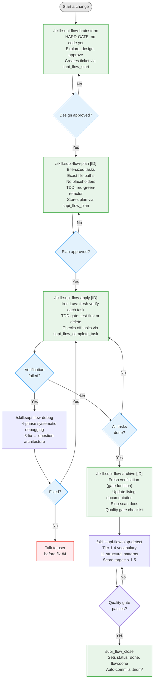

# supi-flow

PI extension for spec-driven workflow with mandatory TNDM ticket coordination.

## Flow



Every flow starts with a TNDM ticket created by `supi_flow_start`. Tickets are mandatory.

## Skills

Six skills ship under `skills/`:

| Skill | Trigger | Purpose |
|---|---|---|
| `supi-flow-brainstorm` | `/supi-flow-brainstorm` | Explore intent + design before code |
| `supi-flow-plan` | `/supi-flow-plan [ID]` | Create bite-sized implementation plan |
| `supi-flow-apply` | `/supi-flow-apply` | Execute plan task by task |
| `supi-flow-archive` | `/supi-flow-archive` | Verify, update docs, close out |
| `supi-flow-debug` | Loaded on demand when blocked | Root-cause debugging protocol |
| `supi-flow-slop-detect` | Loaded on demand during archive | AI-prose detection in docs |

## Tools

Five custom tools registered by the extension:

| Tool | Purpose |
|---|---|
| `supi_tndm_cli` | Thin wrapper around the `tndm` CLI with action enum (create/update/show/list/awareness) |
| `supi_flow_start` | Create a ticket with status=todo and tag=flow:brainstorm |
| `supi_flow_plan` | Store the implementation plan in the ticket's content.md |
| `supi_flow_complete_task` | Check off a numbered task (`**Task N**`) in the plan |
| `supi_flow_close` | Mark done, append verification results, auto-commit `.tndm/` |

Tools should be used instead of calling `tndm` via bash. The agent invokes them with structured parameters.

## Commands

| Command | Description |
|---|---|
| `/supi-flow` | List available flow commands |
| `/supi-flow-status` | Show active tndm tickets in session history |

## Prompt templates

| Prompt | Description |
|---|---|
| `/supi-coding-retro` | Retrospective on project setup, architecture, tooling, workflows, and conventions |

## Ticket flow phase tracking

Flow phases map to TNDM statuses + tags:

| Flow phase | Status | Tags |
|---|---|---|
| Brainstorm | `todo` | `flow:brainstorm` |
| Plan written | `todo` | `flow:planned` |
| Implementing | `in_progress` | `flow:applying` |
| Done | `done` | `flow:done` |

## Dependencies

- **tndm CLI**: required — all ticket operations shell out to `tndm`
- **pi**: discovers bundled skills and prompt templates automatically from the package

## Installation

The extension is auto-discovered when the plugin directory is in pi's extension search path:

```bash
# Option 1: symlink
ln -s "$(pwd)/plugins/supi-flow" ~/.pi/agent/extensions/supi-flow

# Option 2: settings.json
# Add to ~/.pi/agent/settings.json:
# { "extensions": ["./plugins/supi-flow/src/index.ts"] }
```

## Development

```bash
cd plugins/supi-flow
pnpm install

# Type-check
pnpm exec tsc --noEmit

# Run tests
pnpm exec vitest run
```
